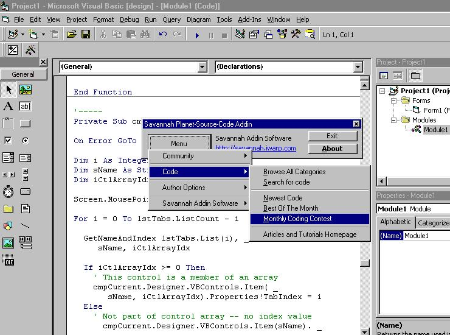



## New Planet\-Source\-Code Addin \- Connect Directly to PSC from VBIDE

### Description

This is a Visual Basic addin that allows the programmer to connect directly to the Planet Source Code Website and do almost everything that can be done on the website while remaining inside the VBIDE. A must have for all Planet-Source-Code users!
 
### More Info
 
Installation Instructions:

1)Download the Add-In to a permanent place on your hard drive.

2) Using My Computer or Explorer, run "Savannah PSC Addin.exe"

3) The Add-In is now installed and registered. To use it

Open up Visual Basic. Under the 'Add-Ins' menu choose Savannah Planet-Source-Code Addin"

>>>>>>>>>>>>>>

Originally modeled after Aldo Vargas's PSC addin, which severly lacked the options I needed!

With this addin, you can reach almost every part of the PSC website from inside the VBIDE!

----

Savannah Addin Software

http://savannah.iwarp.com

orbios@hotmail.com

----

             |
---                |---
**Submitted On**   |2000-07-09 01:20:44
**By**             |[RyanH](https://github.com/Planet-Source-Code/PSCIndex/blob/master/ByAuthor/ryanh.md)
**Level**          |Intermediate
**User Rating**    |4.5 (18 globes from 4 users)
**Compatibility**  |VB 3\.0, VB 4\.0 \(16\-bit\), VB 4\.0 \(32\-bit\), VB 5\.0, VB 6\.0, VB Script, ASP \(Active Server Pages\) 
**Category**       |[Complete Applications](https://github.com/Planet-Source-Code/PSCIndex/blob/master/ByCategory/complete-applications__1-27.md)
**World**          |[Visual Basic](https://github.com/Planet-Source-Code/PSCIndex/blob/master/ByWorld/visual-basic.md)
**Archive File**   |[CODE\_UPLOAD7554792000\.zip](https://github.com/Planet-Source-Code/ryanh-new-planet-source-code-addin-connect-directly-to-psc-from-vbide__1-9617/archive/master.zip)

